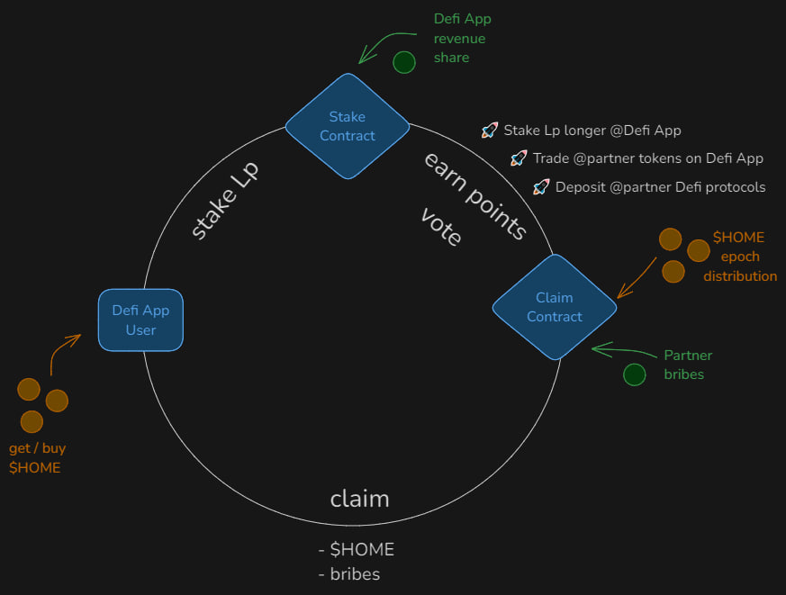

# Defi-app-contracts

This repository uses [foundry](https://book.getfoundry.sh/) and [bun](https://bun.sh/).

## DefiApp Staking Mechanics

**Goals**

- Create DEX liquidity for the $HOME token and progressively increase the $HOME token liquidity while distributing ownership of DeFi App.
- Promote swapping volume within DefiApp
- Promote increase of Total Value Locked (TVL) for DefiApp partner DeFi protocols.
- Future Goal: Implement bribing-voting mechanics that allow for boosting, which can incentivize swapping a specific coin(s) or deposits into specific partner DeFi protocol(s).
- Distribute value to aligned $HOME token holders.

## Staking Mechanics Flywheel Diagram

## Core functionality

**Actor: User**

Methods:  

- `DefiAppStaker.stake(...)`: allows a user to stake liquidity provision tokens (lp) in the staker contract. Each call create a "lock".
- `DLockZap.zap(...)`: allows a user to "zap" tokens directly into the the staker contract. Intermediary logic handles the lp-ing.
- `DefiAppStaker.claimRewards(...)` or `DefiAppStaker.claimAll(...)`: allows a user to claim any earned rewards distributed to stakers.
- `DefiAppStaker.relockExpiredLocks(...)`: allows a user to relock an expired "lock".
- `DefiAppStaker.withdrawExpiredLocks(...)`: allows a user to withdraw an expired "lock" and receive the lp token back.
- `DefiAppHomeCenter.claim(...)`: allows a user to claim emission tokens for a specific epoch with option to directly stake.
- `DefiAppHomeCenter.claimMulti(...)`: allows a user to claim emission tokens for multiple epochs with option to directly stake.

**Actor: Admin**

Various setters and configuration parameters in `DefiAppStaker.sol`, `DefiAppHomeCenter.sol`, `VolatileAMMPoolHelper.sol`.